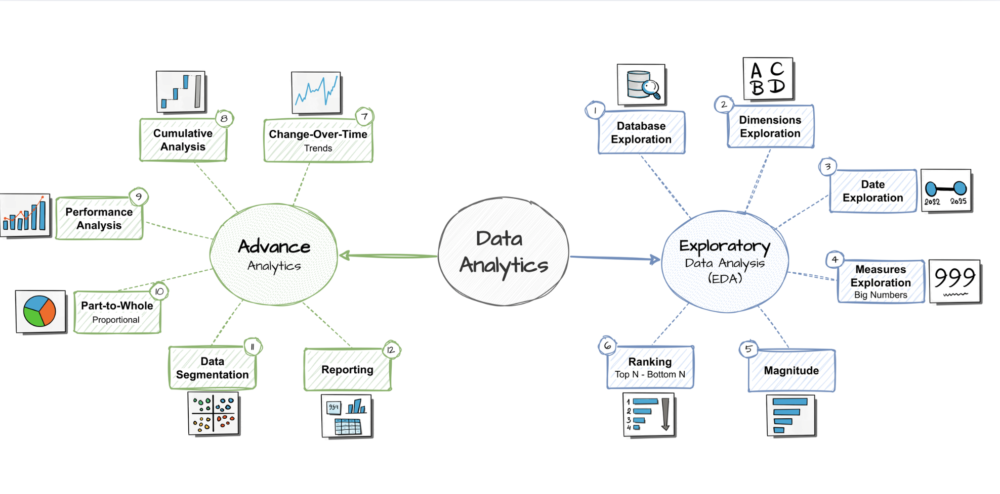

# SQL-Data-Analytics-project-sales

This repository presents a structured collection of SQL scripts designed to demonstrate advanced data analysis and reporting capabilities using relational databases. The analyses are performed on data sourced from the gold layer of my **PostgreSQL-based Data Warehouse built from scratch** ([see project here](https://github.com/dmlk79/sql-datawarehouse-project)).

The repository showcases a wide range of analytical techniques and use cases commonly encountered in business intelligence and data analytics workflows, including:
- Database schema and data profiling
- Dimensional data exploration
- Time range and temporal trends analysis
- Computation of key business measures and metrics
- Magnitude and volume quantification
- Ranking and top‑N analyses
- Time series change detection
- Cumulative and rolling analytics
- Performance evaluation and KPI tracking
- Segmentation and cohort analysis
- Part‑to‑whole contribution analysis
- Customer‑centric reporting
- Product‑centric reporting

Each script is focused on a specific analytical theme and illustrates best practices for writing clear, efficient, and reusable SQL queries to support decision‑making processes. The repository is intended to serve as a reference for data analysts and BI professionals seeking practical SQL patterns for data exploration, segmentation, and reporting within a relational data model.

The diagram below illustrates the end‑to‑end transformation roadmap followed during the construction of the analytical layer:

## 🛡️ License
This project is licensed under the MIT License. You are free to use, modify, and share this project with proper attribution.

## ☕ Stay Connected

Let's stay in touch! Feel free to connect with me on Linkedin.
Hi there ! I am El Hadji Dame Lo KABA IT Engineer / data scientist / machine learning Engineer/ data Engineer.

